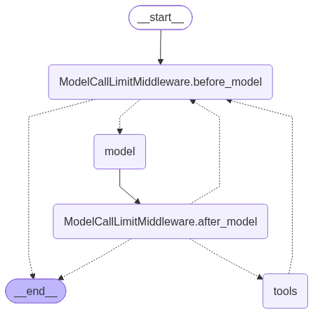

# Homework 3 — a ReAct agent on LangGraph whose tools all arrive over MCP

An agent that builds AI-training offers for small companies. Ask it about a
client in plain language and it searches a module catalogue, looks up whatever it
does not know about their trade, and prices a package — then answers with the
offer.

There is not one `@tool` decorator in the project. Every tool the agent can reach
is served by an MCP server:

| Server | Transport | Tools | Written here? |
| --- | --- | --- | --- |
| `catalogue` | stdio, launched as a subprocess | `describe_catalogue`, `find_modules`, `get_module`, `quote`, `wikipedia_lookup` | yes — [`mcp_server.py`](mcp_server.py) |
| `web` | streamable HTTP, hosted by Tavily | Tavily's own search tools | no — a URL and nothing else |

That split is the argument the assignment asks about. The catalogue server is a
standalone program: Claude Desktop, n8n or a colleague's agent can use it
unchanged, because the interface is a protocol rather than a Python import. The
web server cost no integration code at all. Had the same tools been written as
LangChain `@tool` functions they would work in exactly one framework, in exactly
one process.

## The assignment and how it is met

| Requirement | Where in the code |
| --- | --- |
| Agent built with a framework | LangChain 1.4 / LangGraph. [`agent.py`](agent.py), `create_agent(...)` — compiles to the graph in [`graph.png`](graph.png) |
| Agent pattern: **ReAct** | `create_agent` *is* the ReAct loop: model node → tool node → back to the model while it keeps asking. Visible in the graph and in the `[step N]` trace |
| Works with tools | Five tools from the local MCP server plus Tavily's, all in [`mcp_server.py`](mcp_server.py) and loaded in [`agent.py`](agent.py) |
| Tool: database | SQLite with an FTS5 full-text index over it. [`catalogue.py`](catalogue.py), schema in `SCHEMA`, loader [`seed_db.py`](seed_db.py) |
| Tool: Wikipedia | `wikipedia_lookup`, straight against the public REST API, no key and no SDK |
| Tool: search engine | Tavily, reached as a **remote MCP server** rather than through a client library |
| Answers questions through an LLM | Any OpenAI-compatible endpoint, one place: [`model.py`](model.py) |
| MCP instead of framework-specific tools | The whole tool layer. `MultiServerMCPClient` + `load_mcp_tools` in [`agent.py`](agent.py); nothing is declared with `@tool` |

## Domain: the training catalogue

Nineteen modules across two tracks, 44 hours in total, priced from a rate card.
Synthetic data, but shaped so that a single tool call cannot answer a real
question:

| Table / file | What is in it |
| --- | --- |
| `modules` (19 rows) | id, track, level, hours, delivery mode, prerequisites, keywords, summary |
| `modules_fts` | FTS5 mirror of name + keywords + summary, for search |
| [`data/rates.json`](data/rates.json) | hourly rate per track, headcount surcharge, volume discount bands, travel, VAT |

The rate card is what makes the price a tool's job rather than the model's. An
hourly rate **per track**, a headcount surcharge that starts at the seventh
person, two discount bands, travel billed both ways and 23% VAT on top. A model
asked to total that up will produce something plausible and wrong.

Prerequisites are the other half. `B-108` needs `B-103`, which needs `B-102`,
which needs `B-101`. A package that skips one is not slightly incomplete, it is
unteachable, so `quote` refuses it.

## How a question flows

```
"We are a 12-person accounting firm. The team wastes hours on invoices
 and on client email. Budget around 2500 EUR, online."
      |
      v
create_agent (ReAct)  ---- model decides ---->  describe_catalogue
      |                                         (the real tracks, levels, rate card)
      |<----------------------------------------
      |
      |---- model decides ---->  find_modules("invoices receipts bookkeeping",
      |                                        track="beginners")   -> 0 matches
      |                          find_modules("replying to clients email")
      |<---------------------------------------- 3 matches
      |
      |---- model widens the search, having been told nothing matched
      |     find_modules("invoice processing data entry documents")  -> 6 matches
      |<----------------------------------------
      |
      |---- model decides ---->  quote(["B-101","B-102","B-103","B-104",
      |                                 "B-105","B-109"], people=12,
      |                                delivery="online")
      |<---------------------------------------- every line of the breakdown
      |
      v
answer, in the language the question was asked in
      |
      v
price check: every currency figure in the answer must trace back
             to a number a tool returned
```

Two things in that trace are worth pointing at. The first `find_modules` returns
**zero matches** — the invoice module is on the owners track, not the beginners
track the model filtered to — and the tool says so in words instead of returning
an error, so the model widens the search itself. And the model issues several
searches in parallel in one step, which is why the trace prints the tool name
next to each result.

## The five local tools

| Tool | What it is for |
| --- | --- |
| `describe_catalogue` | The real track names, levels, counts and rate card. No arguments. |
| `find_modules` | Full-text search by topic, with filters on track, level and length. |
| `get_module` | One module by exact id. |
| `quote` | The only source of a price. Returns every line of the breakdown. |
| `wikipedia_lookup` | What a trade actually involves, for a client whose business the model does not know. |

Every docstring in `mcp_server.py` is written as **prompt, not documentation** —
it is the only thing the model reads when deciding whether to call the tool. And
no tool raises into the agent loop: a failure comes back as `{"error": ...}`, so
the model can act on it. A tool that raises kills the run.

## The guard rails

Four, and they are load-bearing rather than decorative.

**1. The database is opened read-only.** [`catalogue.py`](catalogue.py) connects
with `mode=ro`, enforced by SQLite itself, underneath anything the model can
reach. A prompt injection that talks the agent into deleting a module gets a
refusal from the driver. This is the same idea as the read-only Postgres role in
homework 2, moved down a layer. `test_tools.py` proves it by trying a `DELETE`
and passing only when it fails.

**2. Full-text queries are built, never passed through.** FTS5 has its own query
grammar, so a user sentence would be both a syntax error waiting to happen
("invoices, receipts" breaks on the comma) and an injection surface. Terms are
extracted with a regex and quoted as literals, so the model influences the
ranking and never the grammar.

**3. The loop is bounded.** `ModelCallLimitMiddleware(run_limit=10)` with
`exit_behavior="end"`, so a model that keeps searching instead of answering stops
and answers with what it has.

**4. Every price in the answer is traced back to a tool result.** The prompt
forbids inventing a price and the middleware bounds the loop, but nothing
structural stops the model from simply *typing* a plausible total — and on the
first Slovak run of this project it did exactly that. So `unsupported_prices()`
in [`main.py`](main.py) collects every number the tools returned, then checks
every currency-marked figure in the answer against that set, and appends a
warning naming any figure that is not there. Hours and percentages are not
checked, because those are legitimately recombined.

The set holds tool results and what the user said, and **never the agent's own
earlier answers** — counting those let an invented figure from turn one pass as
established fact in turn two, which is written up below.

That last one is the course's own rule — *the model proposes, code decides* —
applied to the output rather than the input.

## Running it

```bash
uv sync
cp .env.example .env        # then fill in OPENAI_API_KEY
uv run seed_db.py           # builds catalogue.sqlite, then verifies the load
uv run main.py
```

Any OpenAI-compatible endpoint works. `.env.example` has lines for a LiteLLM
proxy, LM Studio, Ollama and OpenAI itself. A **Tavily key is optional**: with
one, the agent also loads Tavily's hosted MCP server and can search the live web;
without one it runs on the catalogue and Wikipedia, says so on startup, and works.

```bash
uv run main.py                       # interactive, keeps the conversation
uv run main.py "your question"       # answer once and exit
uv run main.py --tools               # list the tools loaded over MCP
uv run main.py --graph               # write graph.png, print the mermaid source
uv run main.py --quiet "..."         # answer without the trace
uv run test_tools.py                 # 68 checks, no model and no network
```

The first line of output always says what is actually answering, which matters
when a proxy is in the path:

```
MODEL: auto/best-fast at http://localhost:20128/v1
MCP catalogue (stdio):  describe_catalogue, find_modules, get_module, quote, wikipedia_lookup
MCP web (http):         not configured (no TAVILY_API_KEY)
```

## Sample output

A client whose trade the model has to look up first:

```
$ uv run main.py "I run a small freight forwarding company, 5 people.
                  I have no idea where AI would even help us. Where would you start?"

[step 1] TOOL CALL: describe_catalogue
[step 1] TOOL CALL: wikipedia_lookup
         arguments: {"term": "freight forwarder"}
         result <- wikipedia_lookup: {"found": true, "title": "Freight forwarder",
                   "url": "https://en.wikipedia.org/wiki/Freight_forwarder", ...}
[step 2] TOOL CALL: find_modules   (x3, in parallel)
[step 3] TOOL CALL: find_modules   (x2)
[step 4] TOOL CALL: find_modules   (x2)
[step 5] TOOL CALL: get_module
[step 6] TOOL CALL: quote
         arguments: {"module_ids": ["O-201","B-101","B-102","B-103","B-104","O-206"],
                     "people": 5, "delivery": "online"}

ANSWER:
Here is a starting package for your freight forwarding team.

Freight forwarding is a document- and correspondence-heavy business: customs
paperwork, bills of lading, shipment tracking updates, and a constant stream of
emails to carriers and customers. Those are exactly the tasks where AI returns
hours, so I would start there.

**The modules**

- O-201 - Where AI pays for itself in a small company (2 h) - the audit that
  finds your two or three highest-value tasks
- B-101 - What a language model actually is (2 h)
- B-102 - Writing a prompt that works (2.5 h)
- B-103 - Email and everyday writing (2 h) - routine correspondence
- B-104 - Reading long documents and contracts (2.5 h) - summarising contracts
  and pulling clauses out of PDFs
- O-206 - Invoices, receipts and the monthly paperwork (2.5 h)

**Price** - 5 people, online delivery, 13.5 hours total:

| Line | Amount |
|---|---|
| Training (6 modules) | EUR 922.50 |
| Volume discount (10%) | -EUR 92.25 |
| Net | EUR 830.25 |
| VAT (23%) | EUR 190.96 |
| **Total incl. VAT** | **EUR 1,021.21** |

**What you decide**

1. Online or onsite - onsite adds travel (billed per km, both ways); I can price
   it if you tell me your location.
2. Whether the whole team takes the beginners modules, or only the people who
   handle documents and correspondence.
3. If you want to go further later, the natural next step is a shared team
   workspace (O-202) and a chatbot on your own documents (O-208) - those can be
   priced on request.
```

Two details there are the guard rails working. The model does not name a price
for onsite, because it did not call `quote` for onsite — it offers to. Same for
the O-202/O-208 follow-on: "priced on request", not a guess.

### Recovering from a tool error

The same agent, asked in Slovak for onsite training including translation. `B-108`
is online-only, so the first `quote` is refused:

```
[step 5] TOOL CALL: quote
         arguments: {"module_ids": [... "B-108" ...], "people": 8,
                     "delivery": "onsite", "distance_km": 250}
         ERROR <- quote: {"error": "These modules are online-only and cannot be
                  delivered onsite: B-108. Either drop them from the package or
                  quote the whole package as online."}

[step 6] TOOL CALL: quote     (onsite, without B-108)
[step 6] TOOL CALL: quote     (B-108 and its prerequisites, online)
         ERROR <- quote: {"error": "Package is missing prerequisites: B-101,
                  B-102, B-103. That is the complete chain, not just the first
                  level - add all of them and quote again ..."}
[step 7] TOOL CALL: quote     (with the chain)
```

The answer then presents the onsite package and the online translation module as
a separate priced add-on, in Slovak, having discovered the constraint from the
tool rather than from the prompt.

## What went wrong while building this

Three bugs worth writing down, because each was invisible until the agent
actually ran.

**Full-text search missed the obvious module.** FTS5's default tokeniser matches
whole tokens with no stemming, so "we cannot find the right **file**" did not
match the module indexed under "**files**", and "**replying** to customers" did
not match "**replies**". Two of the search checks in `test_tools.py` failed on
the first run. Fixed with a small stemmer in `catalogue.to_match_query` that cuts
each term back and searches it as a prefix — `reply`, `replies` and `replying`
all land on `repl*`. Not a real stemmer, and it over-matches a little, which bm25
ranking absorbs: a wrong module ranked fourth is invisible, a right module
missing entirely is not.

**The call limit was not the limit.** `ModelCallLimitMiddleware(run_limit=8)`
looked like the ceiling, but LangGraph's `recursion_limit` counts **supersteps**,
and middleware adds nodes to the loop — one iteration here is `before_model`,
`model`, `after_model`, `tools`. A `recursion_limit` of 25 therefore cut the run
off after six model calls, and did it by raising `GraphRecursionError` from
inside the MCP transport, which surfaced as a forty-line nested `TaskGroup`
traceback. `RECURSION_LIMIT` is now derived from `MAX_MODEL_CALLS` so the two
cannot drift, and the error is caught and reported in one sentence.

**One error per level of the prerequisite chain.** `quote` reported only the
prerequisites immediately missing. Asked for `B-108`, it said "add B-103"; with
B-103 added, "add B-102"; then "add B-101". Three extra model calls to rediscover
something the catalogue knew all along — and on an eight-call budget the agent
ran out before it answered. `missing_prerequisites()` now walks the chain
transitively and reports it in one error, and the run that used to exhaust the
budget finishes in seven steps.

### A second pass, hunting rather than waiting

The three above turned up by themselves. These four came out of deliberately
probing the edges afterwards, and two of them were quietly serious.

**A negative distance was a discount.** `quote(..., delivery="onsite",
distance_km=-100)` returned `travel: -90.0` and took it off the total. Travel is
`distance × 2 × rate` with nothing asserting the sign, so a fumbled argument —
or a model talked into one — knocked 0.90 EUR off per kilometre "travelled".
Now refused outright rather than clamped to zero, because a negative distance
means the caller got something wrong and treating it as "next door" hides that.

**The price check laundered the prices it was meant to catch.** `known` — the
set of figures a price in the answer must trace back to — was rebuilt each turn
by scanning the whole conversation, and the conversation contains the agent's own
previous replies. So a total the model invented in turn one was established fact
by turn two, and the guard rail silently switched itself off over a conversation.
`known` is now owned by the caller and accumulates from **tool results and user
messages only**. This was the worst of the batch: the check looked like it was
working, and the failure only shows up on the second question.

**`0,450` was read as 450.** `as_amount` treats a comma with three digits after
it as a thousands separator, which is right for `1,450` and wrong for a decimal
written Slovak-style. It matters because `0.45` is the travel rate per km, so the
one number most likely to appear that way was the one being misread by a factor
of a thousand. A thousands group never starts with a lone zero, so that is now
the discriminator.

**The stemmer over-shot on "es".** Fixing the original file/files bug introduced
a smaller one: stripping both letters of `es` turned "files" into "fil" and
"invoices" into "invoic" — short enough to fall below the prefix threshold, so
they reverted to exact matching and stopped finding the singular at all. Only
the plural `s` comes off now, with `sses`/`shes` kept as the exception for
"classes" and "dishes". `ches` and `xes` were deliberately *not* added: they
mangle "caches" and "sizes", where the `e` belongs to the stem.

Three smaller ones, for completeness: `--graph` wrote `graph.png` into whatever
directory the shell happened to be in rather than next to the code; when the
call-limit middleware stopped a run the answer printed was its internal notice,
`Model call limits exceeded: run limit (10/10)`, which tells the reader nothing
about what to do next; and running with no `.env` at all buried the "set
`OPENAI_API_KEY`" message under a nested `TaskGroup` traceback, because the model
was built inside the MCP session and anyio re-wraps a `SystemExit` raised in
there. The model is now built before the session opens. That last one only
surfaced from cloning this repo into a clean directory and running it as a
stranger would — worth doing before calling anything finished.

### A third pass, on the guard rails themselves

Having checked that the agent behaved, the next question was whether the checks
did. Two did not.

**The price check had a hundred-euro-wide hole in it.** The set of figures an
answer is allowed to state was harvested from tool results with the same regex
used on prose — so the `206` in the module id `B-206` became a number a price
could legitimately match. Over a run that touches the catalogue, every id from
`B-101` to `O-210` gets harvested, which means any invented total between about
100 and 211 EUR passed as verified. Tool results are now **parsed and walked**,
and only actual numeric values count: an id is a string and contributes nothing,
while hours, rates and totals are numbers and contribute normally. The walk also
has to unwrap MCP's `[{"type": "text", "text": "<json>"}]` envelope, or every
genuine price gets flagged instead — which is the failure mode you notice, as
opposed to this one, which you do not.

**Reseeding while the agent was running crashed.** `seed_db.py` rebuilds the
database by deleting it first, and Windows will not unlink a file another process
has open — which is exactly the case when an agent is running in another
terminal, holding the catalogue through its MCP server. It failed with a raw
`PermissionError: [WinError 32]` that names the file and not the cause. It now
says what to do about it and exits 2.

The first of those two is the one worth dwelling on. It is not that the guard
rail was missing — it was there, it was tested, and the tests passed. It was
quietly admitting the wrong numbers, and no amount of running the agent would
have shown that, because the symptom is the *absence* of a warning. Checking a
check needs its own pass.

Every one of these has a check in `test_tools.py` pinned to the specific failure,
which is why the count went from 42 to 68.

## Verifying it

```bash
uv run test_tools.py
```

68 checks, no model, no network, no API key.

The price is deliberately **not** verified with the formula that computes it,
since that would only repeat any mistake. `pricing.quote` works package-wide: it
sums the module lines, then charges the extra headcount once against the
package's total hours. The oracle in `test_tools.py` instead writes out an
invoice line by line — one line per module, and one line per extra person per
module — and adds it up. The two are algebraically the same and structurally
different, which is the point: applying the included-headcount allowance once per
*module* instead of once per *package* moves one side and not the other. Eight
packages are checked that way, from 2 modules and 4 people to 8 modules and 20.

Same principle as homework 1, where the mortgage payment was checked by
simulating the loan month by month rather than by rerunning the annuity formula.

The rest:

```
OK  5 modules, 12 people, online  ->  1022.87 EUR
OK  8 modules, 20 people, online  ->  1940.45 EUR
OK  4 modules -> 0% discount      (the band edges, where off-by-one hides)
OK  5 modules -> 10% discount
OK  a mixed-track package charges each module at its own rate  ->  290.0 EUR, not the blended 240.0
OK  the 7th person costs one extra-person rate over the package hours  ->  +18.0 EUR for 4.5 h
OK  the whole prerequisite chain is reported at once, not one level per call  ->  B-101, B-102, B-103
OK  an online-only module is refused onsite and named
OK  100 km onsite is billed as a 200 km round trip  ->  90.0 EUR
OK  a negative distance is refused, not credited against the total
OK  "nobody on the team can find the right ..." finds O-203
OK  "files" and "file" stem alike  ->  file / file
OK  "caches" stems to "cache"  ->  cache
OK  FTS5 syntax in the query is neutralised, not executed
OK  an invented total is caught and a quoted one is not  ->  125.12, 544.0
OK  numbers without a currency marker are not treated as prices
OK  a leading zero marks a decimal comma, not a thousands separator
OK  an invented price is not laundered into the next turn
OK  the catalogue connection refuses writes  ->  attempt to write a readonly database

68/68 checks passed
```

The price-check test uses the real numbers from the run that exposed the problem,
so the regression is pinned to the failure that motivated it.

## The graph



`uv run main.py --graph` regenerates it. The loop is the point: `tools` goes back
to the model, and the middleware sits on both sides of the model node, which is
exactly why the superstep arithmetic in the section above bites.

## Layout

```
main.py          CLI, the streamed trace, and the price-provenance check
agent.py         the ReAct agent: MCP connections, tool loading, system prompt
mcp_server.py    the MCP server - five tools over stdio
model.py         where the LLM comes from, in one place
catalogue.py     SQLite schema, FTS5 search, the read-only connection
pricing.py       the deterministic quote arithmetic
seed_db.py       builds catalogue.sqlite from data/, then verifies the load
test_tools.py    68 checks, no model and no network
visualizer.py    graph.png
data/            the module catalogue and the rate card
.env.example     template, no secrets
```

`catalogue.sqlite` is not committed — it is built from `data/` by `seed_db.py`,
which is the same reasoning as homework 2: the JSON is the source of truth and a
half-migrated database is worse than none.

## A note on holding the MCP session open

`client.get_tools()` is the short way to load MCP tools, and it is what the
course lesson uses. It also opens a **fresh MCP session per tool call**, which for
a stdio server means re-spawning the subprocess and re-opening SQLite on every
single call. Over a run like the freight-forwarder one above — thirteen calls —
that is most of the wall clock.

So `agent.py` opens one session with `client.session("catalogue")` and holds it
for the life of the agent, loading the tools from that session with
`load_mcp_tools`. The remote Tavily server still goes through `get_tools()`,
because HTTP has no subprocess to pay for and the server is stateless.

The trade-off is that the session owns a subprocess, so `build_agent` is an async
context manager and the server is shut down on the way out. Without that the
process outlives the script on Windows.
